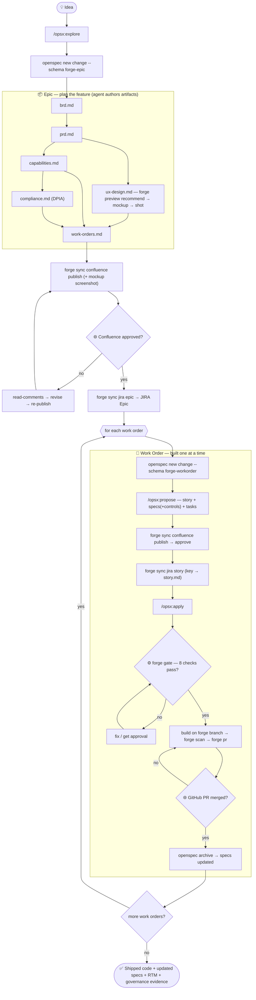
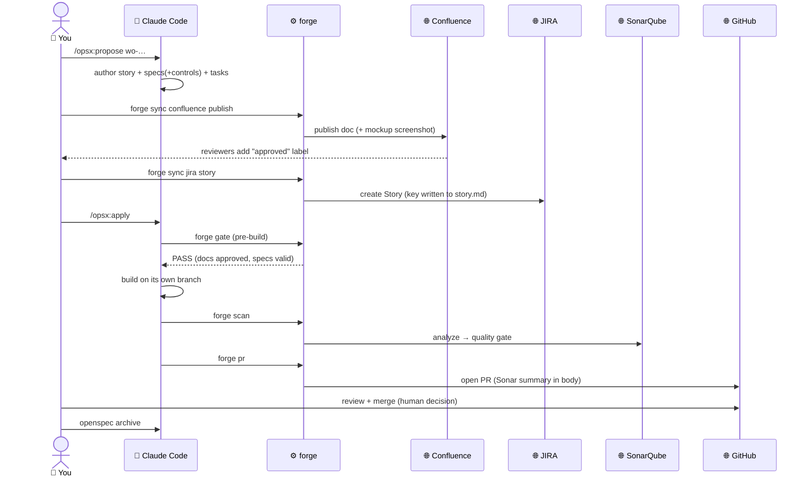

# End-to-End Tutorial — from idea to shipped, governed feature

This walks the **entire** Forge-flavored OpenSpec workflow with one running example:
a self-service **"Data Export"** feature (users download their personal data — a
UU PDP / GDPR data-portability right). It touches personal data (so compliance
lights up) and has a UI (so the design-system flow lights up).

Legend: 👤 you · 🤖 agent (Claude Code, via `/opsx:*`) · ⚙️ `forge` CLI · 🌐 Confluence / JIRA / GitHub / SonarQube.

> Setup shorthand used below: `alias forge='node openspec/forge/forge.mjs'`

---

## Flow at a glance



---

## 0. One-time setup

```bash
npm install -g @fission-ai/openspec         # base CLI
cd my-app && openspec init                   # 👤 pick "Claude Code"
curl -fsSL https://raw.githubusercontent.com/c0d3beat/openspec-forge/main/install.sh | bash   # add the kit
$EDITOR openspec/forge/connections.yaml      # 👤 your JIRA/Confluence/GitHub/SonarQube hosts
cp openspec/forge/.env.example .env && $EDITOR .env   # 👤 tokens
forge doctor                                  # ⚙️ confirms what's LIVE-READY vs offline-only
```

---

## 1. Ideation — think it through

You have a fuzzy idea: *"let users export their data."* Start with OpenSpec's no-stakes thinking partner:

```
👤 /opsx:explore
🤖 What are we exploring?
👤 Self-service data export — users download everything we hold on them.
🤖 That's a data-portability capability (UU PDP Art. 5 / GDPR Art. 20). Key questions:
   which formats? auth/consent? async generation for large accounts? retention of the export file?
   Shall I shape it into an Epic?
👤 Yes.
```

Ideation crystallized into a **feature** → that's an **Epic**.

---

## 2. Plan the feature (the Epic)

```bash
👤 openspec new change data-export --schema forge-epic
👤 /opsx:propose data-export
```

🤖 The agent authors the epic artifacts in dependency order (guided by the `forge-epic` schema):

```
openspec/changes/data-export/
├── brd.md           # business intent: reduce support tickets, meet portability obligations
├── prd.md           # scope, personas (Account Owner), journeys, NFRs (WCAG AA, i18n)
├── ux-design.md     # design-system recommendation + component inventory
├── capabilities.md  # prose: "Export request", "Export generation & delivery"
├── compliance.md    # DPIA: personal data = YES → tagged controls
└── work-orders.md   # the build queue (the stories)
```

A peek at `compliance.md` (the DPIA is substantive because this touches personal data):

```markdown
## DPIA
- Personal data processed? YES — full profile + activity export.
- Lawful basis: legal obligation (data-portability right). Retention: export files purged after 7 days.
## Control Mapping
| Control | Applies? | How satisfied |
| PDP-DATA-SUBJECT-RIGHTS | yes | this feature *is* the portability right |
| PDP-CONSENT | yes | re-auth before an export runs |
| ISO-A8.24-CRYPTO | yes | export encrypted at rest + signed download URL |
```

And `work-orders.md` — the queue, built one at a time:

```markdown
- [ ] wo-export-request  — As an Account Owner, I want to request an export …
- [ ] wo-export-deliver  — As an Account Owner, I want to download my finished export …
```

---

## 3. Choose the UI — recommended from the plan

```bash
👤 forge preview recommend --epic data-export
```
```
⚙️ recommended: MUI (Material Design)  [@mui/material]   confidence: medium
   runner-up:   Ant Design
   scores:      mui=8   ant-design=6   fluent=3   chakra=2   mantine=2
   rationale:   archetype(+3) · complexity/data-grid(+2) · accessibility/WCAG(+2) · i18n(+1)
```
```bash
👤 forge preview mockup --epic data-export       # ⚙️ scaffolds a single-page app-shell mockup (MUI) under ux-preview/
🤖 rebuilds src/App.jsx as the real Data-Export shell (sidebar, records table, export modal) per ux-design.md
👤 forge preview shot --epic data-export         # ⚙️ renders ONE screenshot → ux-preview/mockup.png (system browser)
```

Record the decision in `ux-design.md`. (Prefer Ant Design instead? `forge preview mockup --epic data-export --system ant-design` and re-shoot.)

---

## 4. Review & approve the plan (Confluence)

Content stays in the repo; Confluence is where humans review + sign off.

```bash
👤 forge sync confluence publish --change data-export --doc prd.md        # 🌐 (repeat for brd/ux-design/compliance)
```
🌐 The PM reviews the PRD; the **DPO reviews the DPIA** and adds the `approved` label. UX approves the **mockup screenshot** embedded on the ux-design page.

If reviewers leave comments:
```bash
👤 forge sync confluence read-comments --change data-export
🤖 folds the feedback into the repo docs → re-publishes (which clears `approved`, forcing fresh sign-off — strict re-approval)
```

---

## 5. Track the work (JIRA)

```bash
👤 forge sync jira epic --epic data-export        # 🌐 creates Epic PROJ-1
```

---

## 6. Build a work order — one at a time

Take the first story. **This is the core loop; you repeat it per work order.**



```bash
👤 openspec new change wo-export-request --schema forge-workorder
👤 /opsx:propose wo-export-request
```
🤖 authors `story.md` (persona + acceptance criteria), `specs/**` (delta requirements with WHEN/THEN scenarios, **tagging controls**), and `tasks.md`:

```markdown
### Requirement: Request a data export
The system SHALL let an authenticated user request an export of their personal data
after re-authentication (control: PDP-CONSENT, ISO-A8.24-CRYPTO).

#### Scenario: Owner requests an export
- **WHEN** the owner confirms their password and clicks "Export my data"
- **THEN** an encrypted export job is queued and the owner is notified on completion
```

Get it approved + tracked:
```bash
👤 forge sync confluence publish --workorder wo-export-request   # 🌐 → reviewers approve
👤 forge sync jira story --workorder wo-export-request --epic PROJ-1   # 🌐 Story PROJ-2; key written into story.md
```

Now implement — **the agent does the rest via apply-guidance**:
```bash
👤 /opsx:apply wo-export-request
```
```
🤖 runs ⚙️ forge gate  → checks docs are approved BEFORE building … PASS
🤖 creates branch forge/PROJ-2, implements ONLY this work order, checks off tasks
🤖 runs ⚙️ forge scan   → 🌐 SonarQube (ephemeral per-PR project) → quality gate
🤖 runs ⚙️ forge pr     → 🌐 opens the GitHub PR (Sonar summary in the body)
🤖 stops (does not start another work order)
```

Refresh traceability and confirm the gate:
```bash
👤 forge rtm
👤 forge gate --change wo-export-request
```
```
⚙️  ✓ change-exists   ✓ artifacts-present  ✓ openspec-validate  ✓ rtm-present
    ✓ sonar-quality-gate   ✓ confluence-approval   ✓ jira-sync   ✓ compliance-controls
    GATE: PASS  (advisory — on GitHub Free the merge is a human decision)
```

---

## 7. Review & merge (GitHub)

🌐 On the PR a human reviews the diff, the posted **Sonar quality gate**, and the compliance status.
When satisfied, **they click merge** (on GitHub Free this is the human decision; the gate informed it).

```bash
👤 openspec archive wo-export-request     # folds the delta specs into openspec/specs/, JIRA Story → Done
```

---

## 8. Repeat, then the feature is done

Repeat step 6–7 for `wo-export-deliver`. When the last work order is merged and archived, run:

```bash
👤 forge rtm
```
```
| Work Order         | Requirement                | Controls                      | JIRA              | Confluence | Sonar | Branch          |
| wo-export-request  | Request a data export      | PDP-CONSENT, ISO-A8.24-CRYPTO | PROJ-2 (Done)     | approved   | OK    | forge/PROJ-2    |
| wo-export-deliver  | Download a finished export | ISO-A8.24-CRYPTO              | PROJ-3 (Done)     | approved   | OK    | forge/PROJ-3    |
```

---

## 9. The end product — what "done" looks like

- **Shipped code** — merged PRs, one per reviewed work order.
- **Living specs** — `openspec/specs/` now describes the export capability as built.
- **Traceability** — `rtm.md` links every requirement → work order → compliance control → JIRA → approval → Sonar → branch. Hand this to an auditor.
- **Governance evidence** — DPIA approved by the DPO in Confluence; UU PDP + ISO 27001 controls satisfied and recorded; every build gated on approval + quality + compliance.
- **Tracking** — JIRA Epic PROJ-1 and its Stories all Done.

From a fuzzy idea to enterprise-ready, auditable code — and OpenSpec's core was never modified.

---

## Notes

- **Offline vs live.** Every `forge sync`/`scan`/`pr` runs offline via `--dry-run` / `--result-file <mock.json>` for dry runs and demos; drop those flags (and fill `.env`) to hit the real services. `forge doctor` shows readiness.
- **Enforcement tier.** On GitHub Free the gate is *advisory* (front-loaded approval + posted PR status; a human merges). For a hard, merge-blocking gate, add GitHub Pro's required status checks — no schema/script changes needed.
- **Deeper docs.** `openspec/forge/README.md` (command reference) and `openspec/forge/DESIGN.md` (§13 lifecycle, §17 decisions, §19 roadmap).
